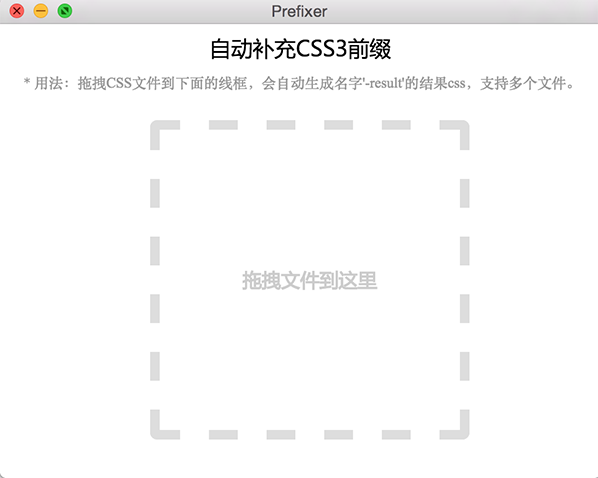

#Prefixer

##介绍
`AutoPrefixer`工具的GUI程序，基于postcss+autoprefixer+electron开发。
The GUI of autoprefixer. Developed by postcss autoprefixer plugins and electron.

##用法
通过拖拽未加前缀的CSS文件到虚线框，即可生成对应的加前缀CSS文件，命名为：原名字-result.css。


拖拽前：
test.css
```css
@keyframes test{
	0%{opacity: 0;}
	100%{opacity: 0;}
}

.test{
	animation:test 0.4s ease-in;
}
```

拖拽后：
test-result.css
```css
@-webkit-keyframes test{
	0%{opacity: 0;}
	100%{opacity: 0;}
}

@keyframes test{
	0%{opacity: 0;}
	100%{opacity: 0;}
}

.test{
	-webkit-animation:test 0.4s ease-in;
	animation:test 0.4s ease-in;
}
```

##下载
MAC版本下载地址：[这里](http://pan.baidu.com/s/1eQNXcaQ)

PC版本下载地址：[这里](http://pan.baidu.com/s/1eRu1e86)


##License
MIT